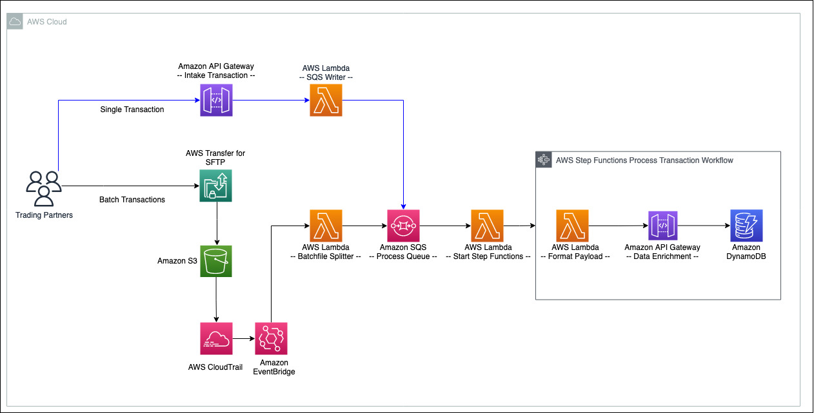

## Simplifying B2B integrations with AWS Step Functions Workflow Studio

This repository contains an AWS Serverless Application Model (SAM) template to deploy a customizable, serverless B2B pipeline. 

The following diagram illustrates components and interactions of the example B2B pipeline architecture:



## Build

To build and deploy the application for the first time, run the following in your shell:

```bash
cd simplified-serverless-b2b-application
sam build
sam deploy --guided --capabilities CAPABILITY_NAMED_IAM
```
## Cleanup

To delete the application, use the AWS CLI replacing &lt;stack-name&gt; with the stack name you configured during deployment, and run the following:

```bash
aws cloudformation delete-stack --stack-name <stack-name>
```

## Security

See [CONTRIBUTING](CONTRIBUTING.md#security-issue-notifications) for more information.

## License

This library is licensed under the MIT-0 License. See the LICENSE file.

